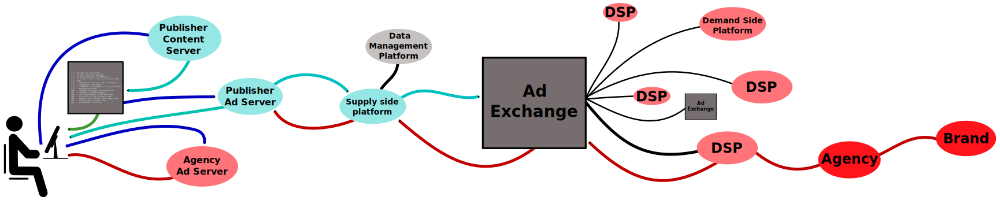
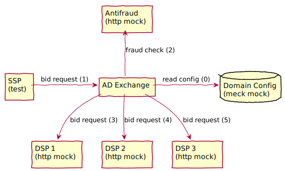

title: Функциональное тестирование через proper на примере ad exchange сервиса
class: animation-fade
layout: true

---

class: center, middle

# {{title}}

Петр Козорезов

Kubient

---
# Разговор про очевидные вещи
# Зачем?

--
 - дать гарантии, что код работает и соответствует требованиям

---
# Каким должно быть?

--
 - как и код, чем меньше и проще тем лучше

--
 - не мешать работать с кодом, а помогать

--
 - давать как можно больше гарантий, что код соответствует спецификации (хорошее покрытие)

--
 - быстро работать и интегрироваться в процессы разработки (CI)

---
# Какое бывает?

--
 - модульное (unit)

--
 - интеграционное

--
 - функциональное

--
 - нагрузочное/стресс

--
 - и многое другое

---
# Что тестируем — AD exchange

.center[.bottom[]]

---
# Функциональная единица — показ рекламы

.center[.bottom[]]

---
# Happy-pass case

.center[.bottom[]]

---
# Happy-pass case

```erlang
test() ->
  State = #{ssps = [1], dsps => [1,2,3]},
  Req   = #{id => 1, ...},
  ok    = send_bid_request(Req, State).

send_bid_request(Req, State) ->
  ok = ssp_request(Req, State),
  ok = antifraud_wait(Req),
  ok = dsp_1_wait(Req, State),
  ok = dsp_2_wait(Req, State),
  ok = dsp_3_wait(Req, State),
  ok = winner_wait(Req, State),
  ok = ssp_wait(Req, State).
```

---
# Хочется разнообразия testcase'ов — proper

## Property based testing

```erlang
biggest(List) =:= last(sort(List)).
```

---
# Хочется разнообразия testcase'ов — proper

## Generators

```erlang
prop_biggest() ->
  ?FORALL(List, list(integer()),
    begin
      biggest(List) =:= lists:last(lists:sort(List))
    end
  ).
```

---
# Happy pass + proper = ❤
## Генератор конфига

```erlang
state() ->
  SSPs = lists:seq(1, 10),
  #{
    dsps => vector(3, dsp(SSPs))),
    ssps => SSPs
  }.

dsp(AllSSPs) ->
  #{
    ssps = vector(3, oneof(AllSSPs))
  }.
```

---
# Happy pass + proper = ❤
## Генератор запросов и ответов

```erlang
request(State) ->
  SSP = oneof(State.ssps),
  #{
    ssp            => SSP,
    bid_req        => #{id => integer()},
    antifraud_resp => oneof([0, 1]),
    dsps_responses => [bid() || DSP <- State.dsps, lists:member(SSP, DSP.ssps)]
  }.

bid() ->
  float(1, 10).
```

---
# Happy pass + proper = ❤
## Исполнение запроса

```erlang
send_bid_request(Req, State) ->
  ok = ssp_request(Req, State),
  ok = antifraud_wait(Req),
  ok = dsp_wait_all(Req, State),
  Winner = auction_model(Req, State),
  ok = winner_wait(Winner, Req, State),
  ok = ssp_wait(Req, State).
```

---
# Happy pass + proper = ❤
## Тест

```erlang
prop_biggest() ->
  ?FORALL({Req, State}, request_and_state(),
    begin
      send_bid_request(Req, State)
    end
  ).

request_and_state() ->
  ?LET(State, state(),
    {State, request(State)}
  ).
```

---
# Пример работы

Ломаем логику антифрода инвертируя её

Шлём в DSP только фродовый траффик

---
# Что в результате
## Плюсы

  - можно смело рефакторить, ничего не сломается

  - код теста нужно менять только при изменении внешнего апи

  - хорошее покрытие, нахождение самых разных частных случаев

  - тест выполняется сравнительно быстро, можно интегрировать в CI

  - кода не много (1.5k строк на 5к строк кода)

---
# Что в результате
## Минусы

  - больше времени на разработку (в данном случае заняло 3 недели)

  - не так просто понимать, что именно сломалось, нужно изучать какой именно кейс сгенерился

  - для нахождения редких проблем может быть нужно генерировать много тест-кейсов

  - сравнительно высокий порог вхождения:

    - нужно изучить концепции property-based тестирования и proper

    - нужно понять схему моков

---
class: center, middle

## Вопросы?
